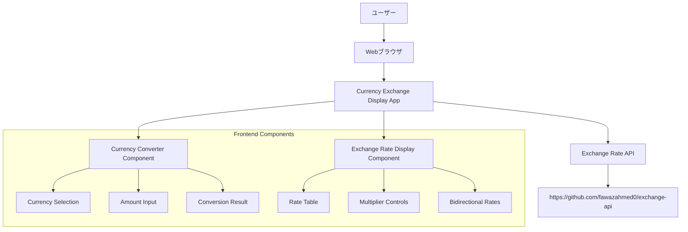
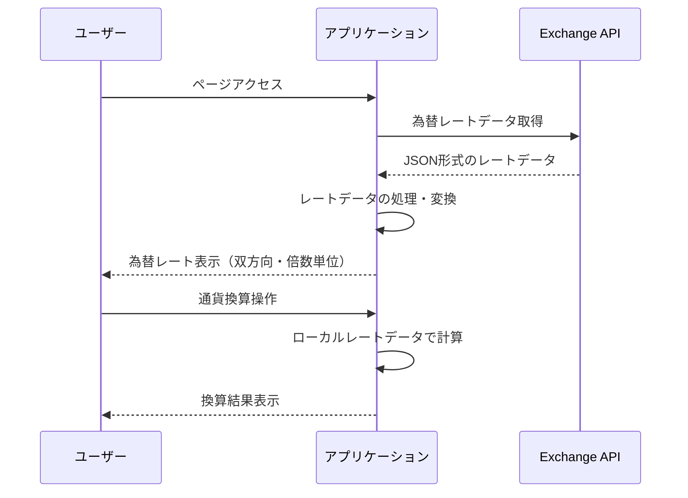

# 通貨為替レート表示Webサイト設計ドキュメント

## 概要

世界の主要通貨の為替レートを表示し、通貨換算機能を提供するWebサイトです。双方向の為替レート表示と、見やすい倍数単位での表示、リアルタイム通貨換算機能を特徴とします。

### 主要機能
- 代表的な世界通貨の為替レート表示
- 双方向為替レート表示（例：USD→JPY および JPY→USD）
- 倍数単位での表示（1単位、10単位、100単位、10,000単位など）
- 通貨換算機能（A通貨からB通貨への変換）
- 日次更新される為替データの表示

## 技術スタック & 依存関係

### フロントエンド
- **HTML5**: セマンティックマークアップ
- **CSS3**: レスポンシブデザイン、Grid/Flexboxレイアウト
- **JavaScript (ES6+)**: 非同期API通信、DOM操作
- **Fetch API**: 外部API通信

### 外部API
- **Exchange API**: https://github.com/fawazahmed0/exchange-api
  - 日次更新
  - 無料利用可能
  - JSON形式でのレスポンス

## アーキテクチャ

### システム構成図



### データフロー



## コンポーネントアーキテクチャ

### コンポーネント階層

```
CurrencyExchangeApp
├── Header
├── ExchangeRateDisplay
│   ├── CurrencyRateTable
│   │   ├── CurrencyRateRow
│   │   └── MultiplierSelector
│   └── BidirectionalRateCard
└── CurrencyConverter
    ├── CurrencySelector (From)
    ├── AmountInput
    ├── CurrencySelector (To)
    └── ConversionResult
```

### コンポーネント定義

#### ExchangeRateDisplay
**目的**: 為替レート一覧の表示とコントロール

**Props/State管理**:
```javascript
// State
{
  rates: Object,           // 為替レートデータ
  baseCurrency: String,    // 基準通貨（デフォルト: 'jpy'）
  multiplier: Number,      // 表示倍数（1, 10, 100, 10000）
  targetCurrencies: Array  // 表示対象通貨リスト
}

// Props
{
  onCurrencySelect: Function  // 通貨選択時のコールバック
}
```

#### CurrencyConverter
**目的**: 通貨換算機能の提供

**Props/State管理**:
```javascript
// State
{
  fromCurrency: String,    // 換算元通貨
  toCurrency: String,      // 換算先通貨
  amount: Number,          // 入力金額
  result: Number,          // 換算結果
  rates: Object           // 為替レートデータ
}
```

#### CurrencyRateTable
**目的**: 為替レート表の表示

**使用例**:
```html
<div class="currency-rate-table">
  <div class="multiplier-controls">
    <button data-multiplier="1">1単位</button>
    <button data-multiplier="10">10単位</button>
    <button data-multiplier="100">100単位</button>
    <button data-multiplier="10000">10,000単位</button>
  </div>
  <table class="rate-table">
    <!-- レート行が動的に生成される -->
  </table>
</div>
```

## ルーティング & ナビゲーション

### シングルページアプリケーション構成
- **メインページ** (`/`): 為替レート表示と通貨換算機能
- **ハッシュベースナビゲーション**:
  - `#rates`: 為替レート表示セクション
  - `#converter`: 通貨換算セクション

## スタイリング戦略

### CSS設計手法
- **BEM命名規則**: `.block__element--modifier`
- **CSS Grid**: メインレイアウト構成
- **Flexbox**: コンポーネント内レイアウト
- **レスポンシブデザイン**: モバイルファースト設計

### テーマ設計
```css
:root {
  --primary-color: #2563eb;
  --secondary-color: #64748b;
  --success-color: #059669;
  --warning-color: #d97706;
  --error-color: #dc2626;
  
  --font-family: 'Inter', -apple-system, BlinkMacSystemFont, sans-serif;
  --border-radius: 8px;
  --shadow: 0 1px 3px rgba(0, 0, 0, 0.1);
}
```

## API統合レイヤー

### Exchange API統合

#### エンドポイント
```javascript
// 最新レート取得
const LATEST_RATES_URL = 'https://cdn.jsdelivr.net/npm/@fawazahmed0/currency-api@latest/v1/currencies';

// 特定通貨のレート取得
const getCurrencyRates = async (baseCurrency) => {
  const url = `${LATEST_RATES_URL}/${baseCurrency}.json`;
  const response = await fetch(url);
  return response.json();
};
```

#### API設計パターン
```javascript
// キャッシュ管理
const exchangeRateCache = new Map();
const CACHE_TIMEOUT = 24 * 60 * 60 * 1000; // 24時間

// 為替レート取得関数
const getRates = async (baseCurrency = 'jpy') => {
  const cacheKey = baseCurrency;
  const cached = exchangeRateCache.get(cacheKey);
  
  if (cached && Date.now() - cached.timestamp < CACHE_TIMEOUT) {
    return cached.data;
  }
  
  try {
    const data = await getCurrencyRates(baseCurrency);
    exchangeRateCache.set(cacheKey, {
      data: data[baseCurrency],
      timestamp: Date.now()
    });
    return data[baseCurrency];
  } catch (error) {
    console.error('為替レート取得エラー:', error);
    return cached ? cached.data : {};
  }
};

// 通貨換算計算関数
const calculateConversion = (fromCurrency, toCurrency, amount, rates) => {
  if (fromCurrency === toCurrency) return amount;
  
  // JPYベースでの計算
  let jpyAmount;
  if (fromCurrency === 'jpy') {
    jpyAmount = amount;
  } else {
    jpyAmount = amount / rates[fromCurrency];
  }
  
  if (toCurrency === 'jpy') {
    return jpyAmount;
  } else {
    return jpyAmount * rates[toCurrency];
  }
};
```

### 対応通貨リスト
```javascript
const SUPPORTED_CURRENCIES = [
  { code: 'jpy', name: '日本円', symbol: '¥' },
  { code: 'usd', name: '米ドル', symbol: '$' },
  { code: 'eur', name: 'ユーロ', symbol: '€' },
  { code: 'gbp', name: '英ポンド', symbol: '£' },
  { code: 'aud', name: '豪ドル', symbol: 'A$' },
  { code: 'cad', name: 'カナダドル', symbol: 'C$' },
  { code: 'chf', name: 'スイスフラン', symbol: 'CHF' },
  { code: 'cny', name: '中国元', symbol: '¥' },
  { code: 'krw', name: '韓国ウォン', symbol: '₩' }
];
```

## ビジネスロジック層

### 為替レート表示ロジック

#### 双方向レート計算
```javascript
// 双方向レート計算関数
const calculateBidirectionalRates = (baseCurrency, targetCurrency, rates, multiplier = 1) => {
  const baseToTarget = rates[targetCurrency] * multiplier;
  const targetToBase = (1 / rates[targetCurrency]) * multiplier;
  
  return {
    forward: {
      from: baseCurrency,
      to: targetCurrency,
      rate: baseToTarget,
      display: `${multiplier}${baseCurrency.toUpperCase()} = ${baseToTarget.toFixed(4)}${targetCurrency.toUpperCase()}`
    },
    reverse: {
      from: targetCurrency,
      to: baseCurrency,
      rate: targetToBase,
      display: `${multiplier}${targetCurrency.toUpperCase()} = ${targetToBase.toFixed(4)}${baseCurrency.toUpperCase()}`
    }
  };
};
```

#### 倍数表示システム
```javascript
// 利用可能な倍数
const MULTIPLIERS = [1, 10, 100, 1000, 10000];

// 倍数適用後のレート表示フォーマット関数
const formatRateWithMultiplier = (rate, multiplier, precision = 4) => {
  const adjustedRate = rate * multiplier;
  return {
    value: adjustedRate,
    display: adjustedRate.toFixed(precision),
    formatted: addCommasToNumber(adjustedRate.toFixed(precision))
  };
};

// 数値に桁区切りカンマを追加する関数
const addCommasToNumber = (numStr) => {
  const parts = numStr.split('.');
  parts[0] = parts[0].replace(/\B(?=(\d{3})+(?!\d))/g, ',');
  return parts.join('.');
};

// 最適な倍数を提案する関数
const getOptimalMultiplier = (rate) => {
  // 小数点以下の桁数に基づいて最適な倍数を提案
  if (rate < 0.01) return 10000;
  if (rate < 0.1) return 1000;
  if (rate < 1) return 100;
  if (rate < 10) return 10;
  return 1;
};
```

### 通貨換算ロジック
```javascript
// 通貨換算実行関数
const convertCurrency = async (fromCurrency, toCurrency, amount) => {
  try {
    const rates = await getRates('jpy');
    const result = calculateConversion(
      fromCurrency, 
      toCurrency, 
      amount, 
      rates
    );
    
    return {
      success: true,
      result: result,
      rate: getExchangeRate(fromCurrency, toCurrency, rates),
      timestamp: new Date().toISOString()
    };
  } catch (error) {
    return {
      success: false,
      error: error.message
    };
  }
};

// 為替レート取得関数
const getExchangeRate = (fromCurrency, toCurrency, rates) => {
  if (fromCurrency === toCurrency) return 1;
  
  if (fromCurrency === 'jpy') {
    return rates[toCurrency];
  } else if (toCurrency === 'jpy') {
    return 1 / rates[fromCurrency];
  } else {
    return rates[toCurrency] / rates[fromCurrency];
  }
};
```

## テスト戦略

### 単体テスト (Jest)

#### 為替レート関数テスト
```javascript
describe('Exchange Rate Functions', () => {
  test('should fetch and cache exchange rates', async () => {
    const rates = await getRates('jpy');
    expect(rates).toBeDefined();
    expect(typeof rates).toBe('object');
  });
  
  test('should calculate currency conversion correctly', () => {
    const rates = { usd: 0.0067, eur: 0.0062 };
    const result = calculateConversion('jpy', 'usd', 1000, rates);
    expect(result).toBeCloseTo(6.7);
  });
});
```

#### 双方向レート計算関数テスト
```javascript
describe('Bidirectional Rate Calculator', () => {
  test('should calculate bidirectional rates correctly', () => {
    const rates = { usd: 0.0067 };
    const result = calculateBidirectionalRates(
      'jpy', 'usd', rates, 100
    );
    
    expect(result.forward.rate).toBeCloseTo(0.67);
    expect(result.reverse.rate).toBeCloseTo(14925.37);
  });
});
```

#### 倍数表示関数テスト
```javascript
describe('Multiplier Display Functions', () => {
  test('should format rate with multiplier correctly', () => {
    const result = formatRateWithMultiplier(0.0067, 1000);
    expect(result.display).toBe('6.7000');
    expect(result.formatted).toBe('6.7000');
  });
  
  test('should suggest optimal multiplier', () => {
    expect(getOptimalMultiplier(0.005)).toBe(10000);
    expect(getOptimalMultiplier(0.05)).toBe(1000);
    expect(getOptimalMultiplier(0.5)).toBe(100);
  });
});
```